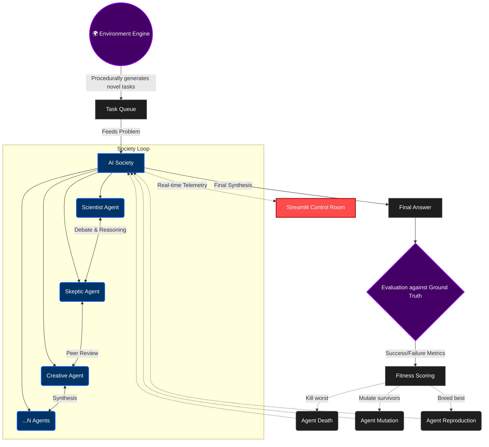

<div align="center">
  <h1>🧬 Agentic Evolution Framework</h1>
  <p><b>An autonomous multi-agent society that self-governs, mutates, and computationally evolves to solve dynamic environments.</b></p>

  [](https://python.org)
  [](https://streamlit.io)
  [](https://build.nvidia.com/)
</div>

<br/>

Instead of a single LLM answering questions, this system creates an **entire society of AI agents** (scientists, engineers, creatives, skeptics) that collaborate, debate, and evolve to solve problems together.

The society isn't static. It **evolves computationally**:
- 🧬 **Mutation:** Agents randomly mutate their reasoning strategies.
- 🌱 **Reproduction:** New agents are born by combining traits of top performers.
- ☠️ **Natural Selection:** Bottom-performing agents are killed off.
- 🗳️ **Democratic Governance:** Agents propose and vote on structural workflow changes.
- 🔄 **Workflow Topology Evolution:** The society physically rewrites its own code execution DAG (Directed Acyclic Graph) to optimize for API token usage and accuracy, utilizing A/B testing to automatically roll back bad mutations.
- 🌍 **Dynamic Environment:** A "Game Master" engine procedurally generates increasingly difficult tasks for the society to adapt to.


---

## 🏗️ Architecture Flow



## 📊 Live Control Room (Streamlit)

The framework includes a real-time telemetry dashboard. While the society is running in the background, you can monitor the population distribution, workflow structures, and token usage via the UI.


---

## 🚀 Quick Start

### 1. Installation

```bash
# Clone the repository
git clone https://github.com/Kartikey-varshney206/agentic-evolution.git
cd agentic-evolution

# Create and activate a virtual environment
python -m venv venv
venv\Scripts\activate  # Windows
source venv/bin/activate # Mac/Linux

# Install dependencies
pip install -e .
pip install streamlit==1.38.0 matplotlib
```

### 2. Configuration

```bash
# Copy the environment file template
cp .env.example .env
```
Edit the `.env` file to configure your LLM provider. The framework supports **NVIDIA NIM**, **Groq**, **Gemini**, and local **Ollama**.

```env
LLM_PROVIDER=nvidia
NVIDIA_API_KEY=your_key_here
```

### 3. Run the Simulation

You can run the simulation in two modes:

**Mode 1: The Deterministic Benchmark (Demo Tasks)**
Runs a hardcoded set of 10 tasks to baseline your LLM's raw performance.
```bash
python -m src
```

**Mode 2: The Infinite Evolutionary Environment ♾️**
The Environment Engine will procedurally generate novel tasks, bumping the global difficulty by `+1` every 5 tasks, forcing the society to evolve overnight.
```bash
python -m src --infinite
```

### 4. Launch the Dashboard
While the simulation is running, open a **new terminal window** and launch the Streamlit control room:
```bash
streamlit run src/dashboard/app.py --server.enableCORS false --server.enableXsrfProtection false
```

---

## ⚙️ Core Modules

| Module | Description |
|---|---|
| `agents/` | Defines agent memory, personality factories, and multi-provider LLM abstraction. |
| `society/` | Orchestrates the multi-agent debate, discussion rules, and peer review synthesis. |
| `evolution/` | Handles fitness scoring, natural selection, random genetic mutation, and crossover reproduction. |
| `governance/` | Allows agents to computationally vote on systemic changes to their own processing workflow. |
| `workflow/` | A dynamic DAG topology executor that runs tasks through self-modifying pipelines with automatic A/B testing rollbacks. |
| `environment/` | A procedural "Game Master" engine that authors novel logic puzzles with objective ground truths. |
| `dashboard/` | A Streamlit app that parses the `civilization_state.json` file for real-time visualization. |

---

<div align="center">
  <i>Built for autonomous AI systems research.</i>
</div>
